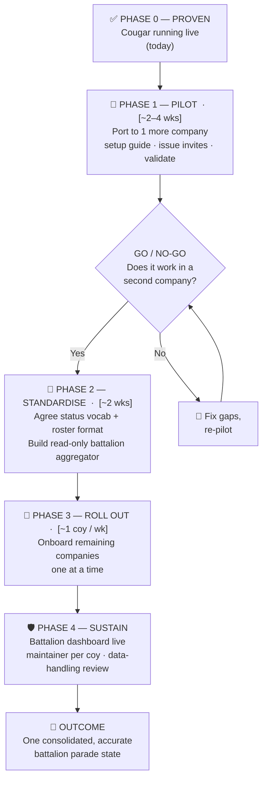

# Battalion-Wide Adoption Plan (simple phased rollout)

Fill the `[timeframes]` with your own estimates. One go/no-go gate after the pilot
keeps the battalion's risk low — you only scale after a second company proves it.

---

## Mermaid



---

## ASCII fallback

```
  ✅ PHASE 0            🧪 PHASE 1           📐 PHASE 2            🚀 PHASE 3          🛡️ PHASE 4
  PROVEN               PILOT                STANDARDISE          ROLL OUT            SUSTAIN
  ────────             ─────────            ───────────          ─────────           ────────
  Cougar runs   ─────▶ Port to 1     ─┬───▶ Agree status  ─────▶ Onboard      ─────▶ Bn dashboard live
  live today           more company   │     vocab + roster        remaining          maintainer / coy
                       validate it    │     Build read-only       companies          data review
                                      │     battalion aggregator   one at a time           │
                                  [GO / NO-GO]                                             ▼
                                      │                                          🎯 One accurate
                                      │ NO → fix gaps, re-pilot ──┐                 battalion
                                      └───────────────────────────┘                 parade state
```

---

## One-line speaker note per phase

- **Phase 0 — Proven:** "It already runs in Cougar. We're not starting from zero."
- **Phase 1 — Pilot:** "Stand up one more company off the setup guide — low cost, low risk, a real second data point."
- **Go/No-Go:** "We only scale if it works in a company that isn't mine."
- **Phase 2 — Standardise:** "The real work — agree on status vocabulary so the roll-up is clean — then build the read-only battalion layer."
- **Phase 3 — Roll out:** "Onboard the rest, one company a week, each staying in control of its own data."
- **Phase 4 — Sustain:** "Battalion gets one consolidated parade state; we resource a maintainer per company and a proper data-handling review."

> Ties to **Slide 17 (the ask):** you're really only asking HQ to approve **Phases 1–2**.
