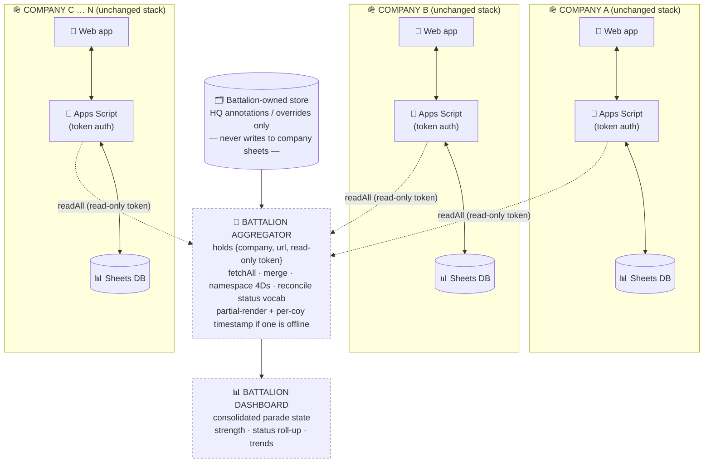

# Battalion-Wide Architecture (hub-and-spoke, read-only roll-up)

Each company keeps the **exact stack it runs today** — own Sheet, own Apps Script,
own app. Battalion adds **one new thing**: a read-only aggregator that *pulls* from
every company and consolidates. Battalion never writes down, so companies stay in
full control of their own data (and there are no sync conflicts to resolve).

---

## Mermaid



> 🔒 The dotted arrows are **read-only**. Data flows **up** (company → battalion) only.
> Nothing flows down into a company's Sheet — that's the security guarantee *and* why
> there are no write conflicts at battalion level.

---

## ASCII fallback

```
   COMPANY A                COMPANY B                COMPANY C … N
   ─────────                ─────────                ─────────────
   📱 App ⇄ 🔐 Script        📱 App ⇄ 🔐 Script        📱 App ⇄ 🔐 Script
            ⇕                         ⇕                         ⇕
        📊 Sheets DB              📊 Sheets DB              📊 Sheets DB
            │                         │                         │
            │  readAll                │  readAll                │  readAll
            │  (read-only token)      │  (read-only token)      │  (read-only token)
            └─────────────┐          │          ┌──────────────┘
                          ▼          ▼          ▼
                ┌───────────────────────────────────────┐
   🗂️ Bn store  │     🔄 BATTALION AGGREGATOR            │
   (HQ over- ──▶│  fetchAll · merge · namespace 4Ds     │
    rides only) │  reconcile status vocab               │
                │  partial-render + timestamp if offline│
                └───────────────────────────────────────┘
                                  │
                                  ▼
                ┌───────────────────────────────────────┐
                │   📊 BATTALION DASHBOARD               │
                │   consolidated parade state            │
                │   strength · status roll-up · trends   │
                └───────────────────────────────────────┘

        ▲ data flows UP only — battalion never writes to a company Sheet ▲
```

---

## The four design guarantees (speaker notes)

1. **Companies are untouched** — each runs the same stack as today; adoption = copy + deploy.
2. **Read-only up** — battalion pulls via each company's existing `readAll` API with a
   *read-only* token. No writes down → no conflicts, no risk of corrupting a company's data.
3. **Resilient** — if a company is offline, the aggregator shows a partial picture with a
   *"last synced HHMM"* per company, never a silently-wrong total.
4. **HQ edits stay separate** — any battalion-level annotation/override lives in a
   **battalion-owned store** and is merged at display time, so company and HQ data never collide.

> Pairs with **Slide 13** (battalion parade-state roll-up) and **Slide 16** (security —
> "read-only up" is the headline). Use this as the architecture backup if someone asks "how?".
