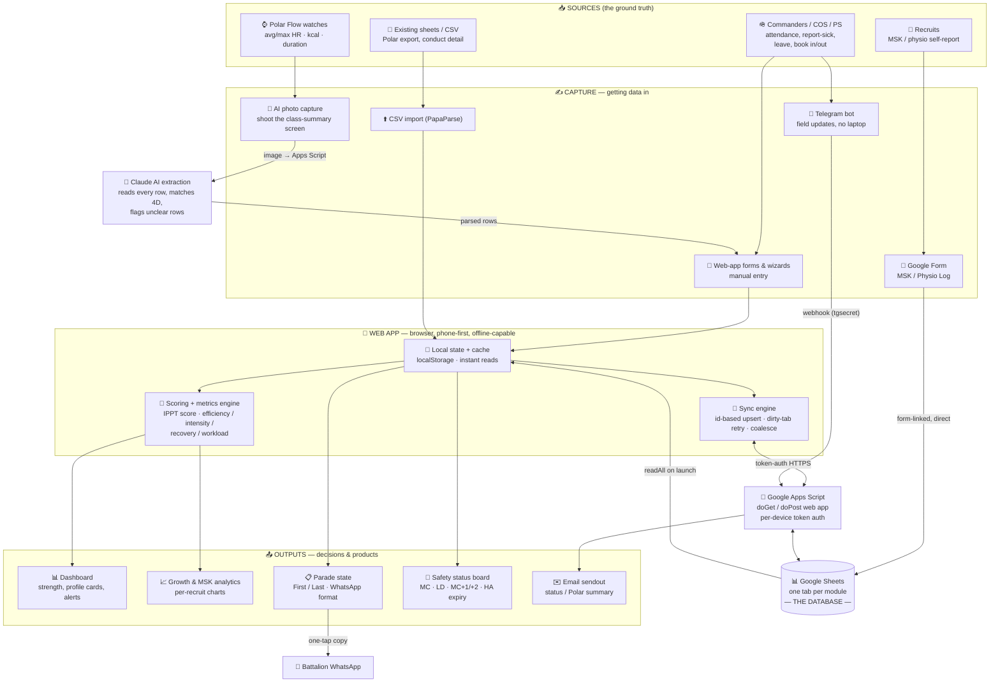

# Cougar Data System — Current Dataflow (input → output)

Two views of the same flow: a **Mermaid** diagram (renders in VS Code/GitHub/most
slide tools) and an **ASCII** fallback for printing or pasting where Mermaid won't render.

---

## Mermaid



---

## ASCII fallback

```
 SOURCES                CAPTURE (data IN)            APP + BACKEND                 OUTPUTS (data OUT)
 ───────                ─────────────────            ─────────────                 ──────────────────

 ⌚ Polar watches ─────▶ 📸 AI photo capture ─┐
                                              │ image
                                              ▼
                                       🧩 Claude AI extraction
                                       (reads rows, matches 4D)
                                              │ parsed rows
                                              ▼
 🪖 Cmdrs/COS/PS ──────▶ 📱 Web-app forms ────┼────▶ 🧠 Local state + cache ──▶ 📐 Scoring/metrics ──▶ 📊 Dashboard
                  └────▶ 🤖 Telegram bot ──┐  │            │  ▲                      (IPPT, efficiency,   📈 Growth/MSK charts
 🧍 Recruits ─────────▶ 📝 Google Form ──┐ │  │            ▼  │ readAll               recovery, workload)
 📄 Sheets/CSV ───────▶ ⬆️ CSV import ────┼─┼─┘     🔄 Sync engine                          │
                                         │ │ │      (upsert, dirty-retry)                   ▼
                                         │ │ └──────────│  ▲                          📋 Parade state ──▶ 💬 Bn WhatsApp
                                         │ │  token-auth ▼  │                          🏥 Safety board
                                         │ │     🔐 Google Apps Script ◀──────────────  (MC/LD/MC+1/HA)
                                         │ └─webhook──────▶ (doGet/doPost, auth)        ✉️ Email sendout
                                         │                      │  ▲
                                         │ form-linked          ▼  │
                                         └────────────▶ 📊 GOOGLE SHEETS (database)
                                                        one tab per module
```

---

## How to read it (speaker note)

- **Three input rails:** automated (Polar → AI photo), assisted (Telegram bot, Google Form),
  and manual (web-app forms / CSV). Everything funnels into **one database — Google Sheets**.
- **The app is a cache, not the source:** it reads the Sheet on launch, works offline, and
  syncs changes back through the **Apps Script auth gateway** (per-device token).
- **Outputs are all derived from that single store:** dashboard, growth charts, the
  battalion-format **parade state**, the **safety status board**, and **email sendout**.
- **One source in, many products out** — that's the whole pitch in one picture.
